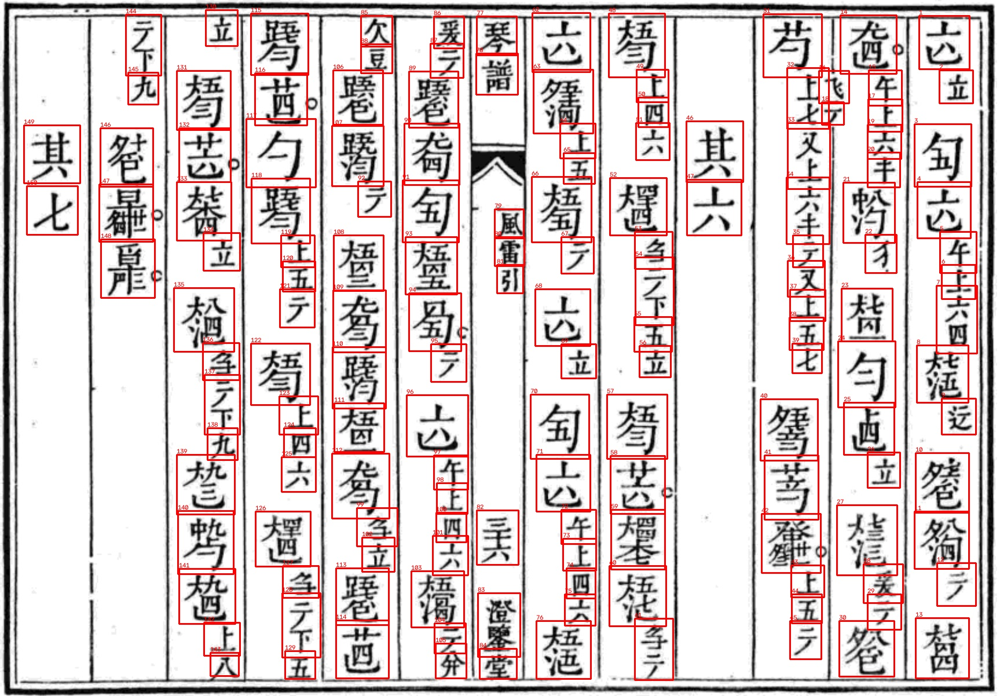
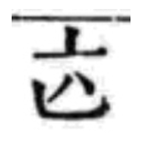
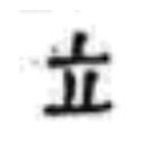
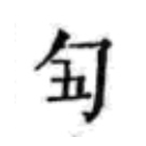
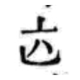
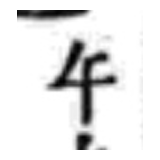

# 古琴減字譜字框偵測（Guqin Jianzipu Detection）

本專案使用 **PaddleOCR PP-OCRv5 mobile detection**，偵測古琴譜影像中的減字譜候選字框。模型處理的是「譜字在哪裡」，不是直接辨識弦序、徽位或指法內容。



## 專案目的

古琴減字譜由弦序、徽位、左右手指法與走手等部件組合而成。同一譜字的部件可能互相分離，一般連通區域切割容易將同一字拆開，或把上下兩字合併。本專案以人工字框微調文字偵測模型，先產生候選譜字框，再配合版面與直式欄位規則排序。

## 目前結果

模型以《琴曲集成・五知齋琴譜》的人工校正琴譜影像進行小規模微調。目前資料為26張訓練影像及4張驗證影像，最佳驗證結果如下：

| 指標 | 結果 |
| --- | ---: |
| Precision | 0.719 |
| Recall | 0.961 |
| Hmean | 0.823 |

資料量仍小，數值只反映目前驗證集，不代表模型可直接泛化至所有琴譜版本。輸出仍可能包含標題、小註、格線或拆分／合併錯誤，正式研究應保留人工校正。

## 目錄

```text
.
├── infer.py                         # 呼叫PaddleOCR進行字框推論
├── labeler.py                       # 依序命名與相似圖片建議工具
├── requirements-labeler.txt
├── configs/
│   └── guqin_PP-OCRv5_mobile_det.yml
├── model/
│   └── best_accuracy.states         # 訓練狀態與評估資訊
├── model_parts/                     # 最佳權重的分割檔
├── assemble_model.py                # 還原best_accuracy.pdparams
└── examples/
    ├── 19-1_input.jpg
    ├── 19-1_prediction.jpg
    ├── 20-2_input.jpg
    ├── 20-2_prediction.jpg
    ├── 21-1_input.jpg
    └── 21-1_prediction.jpg
```

完整PDF、完整切割結果、人工標註資料及49,572張候選字圖不包含在本倉庫。

## 安裝

本專案依賴PaddleOCR原始碼環境。請先依[PaddleOCR官方說明](https://github.com/PaddlePaddle/PaddleOCR)安裝PaddlePaddle與PaddleOCR，再下載本倉庫：

```bash
git clone https://github.com/PaddlePaddle/PaddleOCR.git
git clone https://github.com/Mariannalee/guqin-jianzipu-detection.git
```

GitHub版本將模型分割保存。下載後先還原權重（會驗證SHA-256）：

```bash
cd guqin-jianzipu-detection
python assemble_model.py
```

## 使用模型

先進入已安裝PaddleOCR套件的Python環境，再執行：

```bash
python infer.py examples/19-1_input.jpg \
  --paddle-dir ../PaddleOCR \
  --output output
```

也可以輸入整個圖片資料夾：

```bash
python infer.py path/to/images \
  --paddle-dir ../PaddleOCR \
  --output output
```

推論後會產生：

- `output/predictions.txt`：每張影像的候選多邊形座標。
- `output/det_results/`：PaddleOCR繪製的紅框預覽（實際子目錄依PaddleOCR版本而定）。

## 推論流程

```text
琴譜影像
→ PP-OCRv5候選字框偵測
→ 排除過大、過小與框外區域
→ 依直式欄位由右至左排列
→ 欄內由上至下編號
→ 輸出候選字圖
```

本倉庫提供的`infer.py`負責執行模型推論；PDF分頁、上下琴譜外框偵測、直式欄位排序與單字裁切仍屬研究中的前後處理流程，尚未整理成通用API。

## 互動式命名工具

`labeler.py`用於依琴譜順序標註已切割的單字圖片。畫面同時顯示前兩張、目前圖片與後兩張，方便參照前後文；可使用上一張、下一張及「下一張未命名」切換。

以下五張為連續圖片。個別裁切後的小部件有時無法單獨判斷，因此標註介面會保留相鄰圖片供人工參考。

| 前二張 | 前一張 | 目前圖片 | 後一張 | 後二張 |
| --- | --- | --- | --- | --- |
|  |  |  |  |  |

標註欄位只有：

- `string1`：第一個弦序資訊。
- `string2`：第二個弦序資訊。
- `hui1`：第一個徽位。
- `hui2`：第二個徽位。
- `other`：其他指法、演奏符號或備註。

安裝命名工具所需套件：

```bash
python -m pip install -r requirements-labeler.txt
```

Python環境也必須包含Tkinter。Windows官方Python通常已包含；macOS或Linux若缺少，請使用系統套件管理工具安裝對應的Python Tk套件。

啟動工具：

```bash
python labeler.py path/to/cropped_glyphs
```

也可以指定資料庫與CSV的位置：

```bash
python labeler.py path/to/cropped_glyphs \
  --database annotations.sqlite3 \
  --csv annotations.csv
```

每次按下「確認」後，結果會立即寫入SQLite並同步輸出CSV；關閉程式後標註與瀏覽進度不會消失。尚未標註的圖片會保留在影像索引中，但不會寫入空白答案。

工具會記錄每張圖片的64-bit dHash及墨跡比例，並以已確認的相似圖片提出最多三組候選標註。這是相似影像檢索，不是重新訓練深度學習權重；建議結果仍須由使用者確認或修改。

## 模型限制

- 模型主要學習《澄鑒堂琴譜》的掃描與排版風格。
- 不同刻本、字體、解析度或影像品質可能降低效果。
- 本模型只做字框偵測，不輸出`string1`、`string2`、`hui1`、`hui2`或`other`。
- 命名工具的候選建議只使用簡易影像特徵，不代表正式辨識準確率。
- 範例影像只供研究方法展示，不代表完整資料集。

## 技術來源

本模型以[PaddleOCR](https://github.com/PaddlePaddle/PaddleOCR)的PP-OCRv5 mobile detection預訓練模型為基礎進行微調。使用本權重時，亦請遵守PaddleOCR及原始資料各自的授權或使用規範。

## 安全提醒

模型權重為Paddle格式。請只載入可信來源的模型檔案，並建議在隔離的Python虛擬環境中執行。
